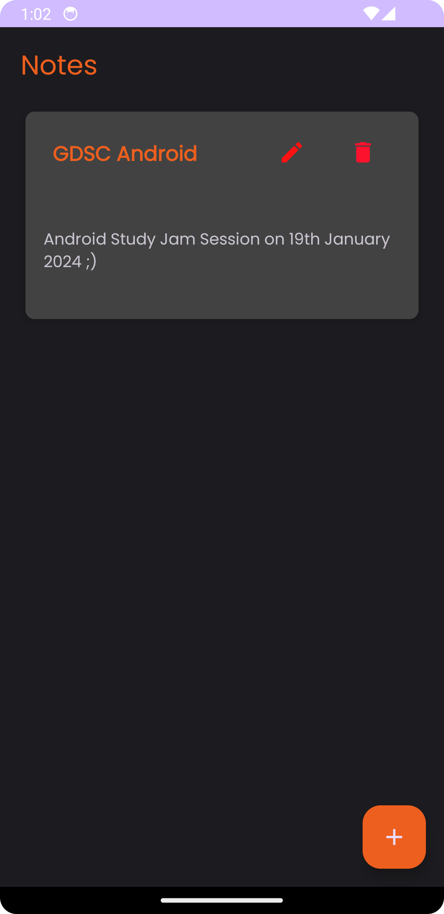
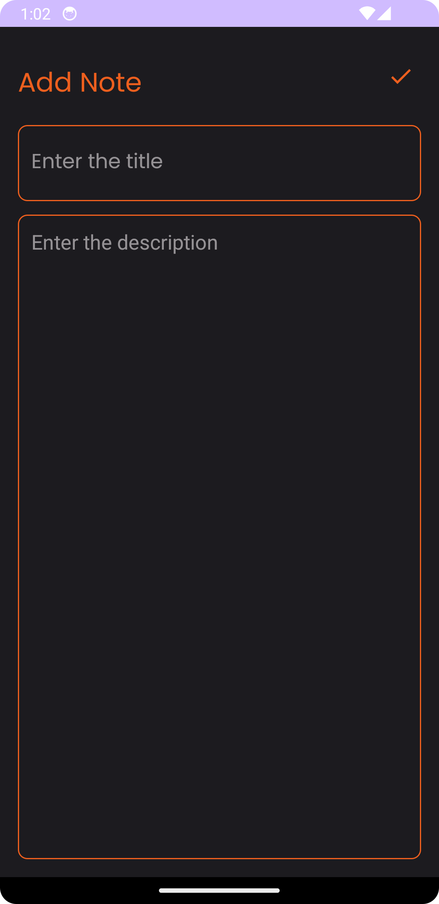
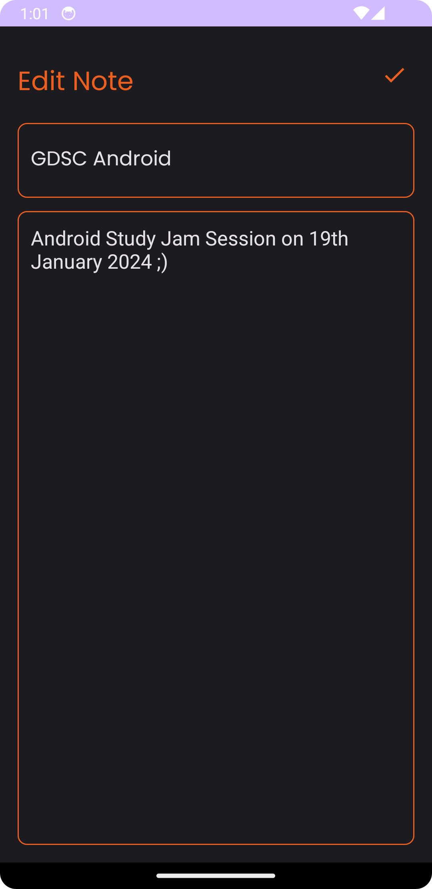

# Notes App

## Overview

Welcome to the GDSC IITH's Notes App! This app is designed to help you easily manage and organize your notes. Whether you're in a lecture, attending a workshop, or just jotting down your thoughts, this app has got you covered.

## Screenshots
<p float="left" >
  " "
  " "
  
</p>


## Download

Click the button below to download the GDSC IITH Notes App:

[](https://github.com/GDSC-IITH/NotesApp/releases/latest)

## Installation

1. Clone the repository to your local machine:

    ```bash
    git clone https://github.com/GDSCIITH/Notes-App.git
    ```

2. Open the project in your preferred IDE and run the app on your device or emulator.

## Requirements

- Android Studio (or any preferred Android development environment)
- Android device or emulator running Android 5.0 (API level 21) or higher

## Contributions

We welcome contributions from the community! If you have ideas for new features, improvements, or bug fixes, feel free to submit a pull request.

## Issues

If you encounter any issues or have suggestions for improvements, please [open an issue](https://github.com/GDSC-IITH/NotesApp/issues) on our GitHub repository.

## License

This project is licensed under the [MIT License](LICENSE).

Happy note-taking! 📝